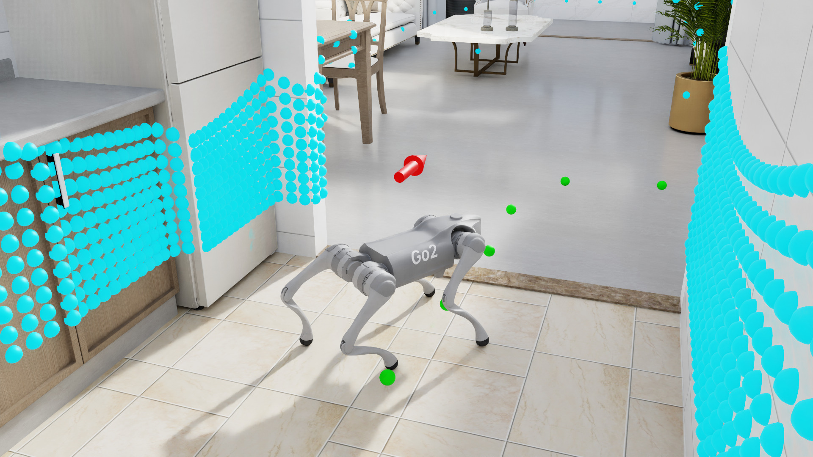
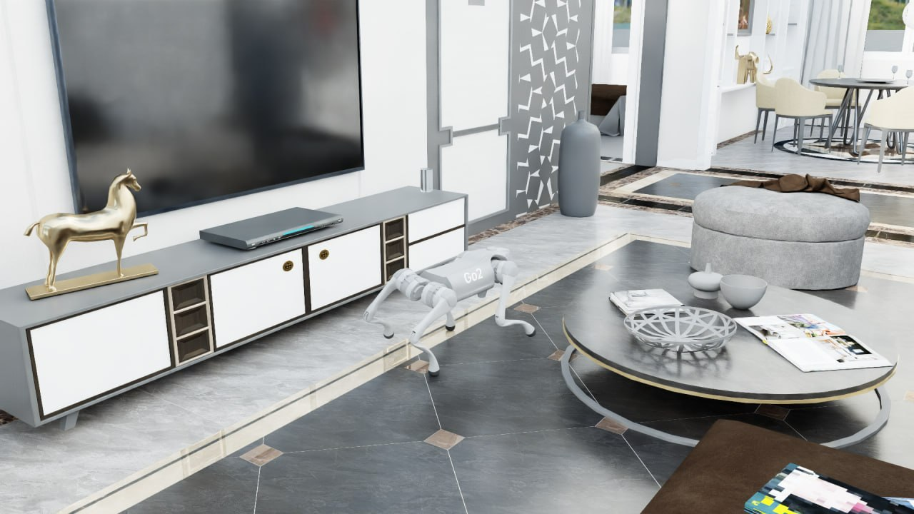

# DRL quadruped hybrid navigation




## Requirements:
 - Ubuntu 24.04
 - Nvidia drivers >= 580.x
 - RTX-capable GPU with >=12GB VRAM
## Installation

```bash
$ ./setup.sh
$ source env_isaaclab/bin/activate
```

### Dataset setup

Clone huggingface repo (25GB of disk required)
```bash
# install git xet and download dataset
$ ./download_dataset.sh

# preprocess the dataset
$ python3 src/preprocessing/preprocess_interioragent.py 
```

Set the `dataset_folder` parameter in `dataset_cfg.yaml` to the InteriorAgent repo folder.



*A preprocessed `kujiale_*` scene loaded by the `*_full` tasks.*

### Weights & Biases setup (optional)
Add the wandb username and project name into a .env file:
```bash
$ echo -e "WANDB_USERNAME=<user> \nWANDB_PROJECT=<project>" > .env
```


# Usage
Train a simple policy that navigates in empty environments

```bash
$ python3 train_policy.py --map=40 --num_envs=128 --max_iterations=500 --task="go2_lidar_empty"
```

`--map` is mandatory and selects the scene to train on: `40`, `0040` and `kujiale_0040` all mean the same map, which
must be one of the preprocessed ones under `dataset_folder`. It overrides `current_env` in `dataset_cfg.yaml`, which
is now only a fallback for the annotation notebook.

The available tasks are:

```bash
- go2_lidar_full # (default)
- go2_lidar_empty
- go2_vision_empty # (experimental)
- go2_vision_full # (experimental)
- go2_depth_full # (experimental)
```

where the `*_full` tasks build the entire scene, whereas `*_empty` ones are just an empty plane.

The complete MDP configurations are defined in the `src/tasks/go2_*.py` files.
